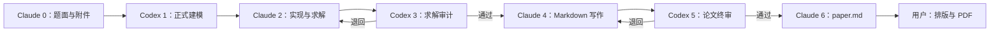
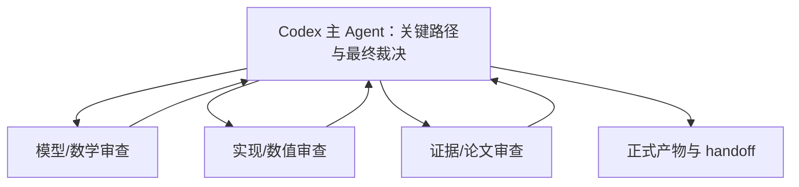

# cumcm-skill v2.0

CUMCM 全国大学生数学建模竞赛的 **Codex + Claude Code 双 Agent 文件化接力工作流**。

- Claude Code：题面解析、代码与求解、论文写作、最终 Markdown 装配
- Codex：查漏补缺、正式建模、求解审计、论文终审；阶段内部可动态调用 SubAgent 专家
- 共享接口：`state/workflow.json`、阶段产物和标准 handoff
- 最终交付：`paper.md`；Word/WPS 排版和 PDF 由用户手工完成

本项目基于 [mathmodel-skill](https://github.com/handsomeZR-netizen/mathmodel-skill) v6.1.0 演进而来，感谢原作者徐子锐（handsomeZR-netizen）的流程设计与资料组织。v1 的 10 阶段资料仍保留用于旧项目兼容；v2 新项目使用 7 阶段流程。

## 为什么改成双 Agent 接力

两个客户端不共享聊天上下文，因此不能依靠“把上一次对话复制过来”。v2 把模型规格、实现契约、结果、审计意见和论文修改单全部落到工作区，由状态文件指定唯一负责人。



## 单一 Skill 真源

不要在 `.agents/skills` 和 `.claude/skills` 维护两份独立副本。推荐把主仓库放在：

```text
~/.agents/skills/cumcm-skill
```

再让 Claude Code 的发现路径指向同一目录。Windows 可以使用 Junction，但在创建前必须先比较并备份旧副本：

```powershell
$source = [IO.Path]::GetFullPath("$HOME\.agents\skills\cumcm-skill")
$target = [IO.Path]::GetFullPath("$HOME\.claude\skills\cumcm-skill")
$backup = "$target.backup-$(Get-Date -Format yyyyMMdd-HHmmss)"

# 先确认 target 是 clean 的独立副本，再保留整目录备份
if ((git -C $target status --porcelain)) { throw "Claude Skill 存在未合并修改，停止迁移" }
Move-Item -LiteralPath $target -Destination $backup
New-Item -ItemType Junction -Path $target -Target $source
Get-Item -LiteralPath $target | Select-Object FullName, LinkType, Target
```

以后只在主仓库修改和提交。

## 快速开始

### 1. 准备项目

```text
my-cumcm-project/
└── input/
    ├── problem.pdf        # 或 problem.md
    └── data/              # 题目附件
```

用户不需要提前填写队伍人数、成员能力、截止时间或运行模式。

### 2. 在 Claude Code 启动 Stage 0

明确调用 `$cumcm-skill`。首次初始化等价于：

```bash
python <skill>/scripts/init_workspace.py /path/to/my-cumcm-project
```

### 3. 按 owner 切换客户端

随时查看：

```bash
python <skill>/scripts/workflow.py --workspace /path/to/my-cumcm-project status
```

- `current_owner: claude`：在 Claude Code 继续；
- `current_owner: codex`：在 Codex 继续；
- `current_owner: user` 且 `status: complete`：检查 `paper.md` 并手工排版。

## 7 阶段

| Stage | Owner | 主要产物 |
|---|---|---|
| 0 题面解析 | Claude | `artifacts/problem_analysis.md`、`data_inventory.md` |
| 1 正式建模 | Codex | `model_spec.md`、`implementation_contract.md`、文献计划 |
| 2 实现求解 | Claude | `code/`、`results/`、`figures/`、运行清单 |
| 3 求解审计 | Codex | `reviews/solution_audit.md`；可退回 Stage 2 |
| 4 论文写作 | Claude | `paper_draft.md`、支撑材料清单 |
| 5 论文终审 | Codex | `final_review.md`、`final_patch_plan.json`；可退回 Stage 4 |
| 6 最终装配 | Claude | `paper.md`、`submission_checklist.md` |

完整职责见 `references/workflow/`，交接规则见 `references/handoff_protocol.md`。

## Codex 阶段内部专家

Stage 1、3、5 采用“Codex 主 Agent 裁决 + 动态 SubAgent 独立审查”：



SubAgent 默认只读，不修改 `workflow.json`、共享产物或 handoff。主 Agent 独立核验证据，不按多数票决定通过；confirmed blocker 或未闭环 high 问题会触发修订。建议角色和国奖级质量门见 `references/runtime/codex_subagents.md`。这里的“国奖级”指高质量目标，不构成获奖保证。

## 工作区结构

```text
project/
├── input/
├── state/
│   ├── workflow.json
│   ├── capabilities.json
│   ├── artifact_manifest.json
│   └── handoffs/
├── artifacts/
│   └── run_manifest.json
├── literature/
├── code/
├── results/
├── figures/
├── reviews/
│   └── subagents/
├── paper_workspace/
├── paper_draft.md
└── paper.md
```

`revision` 用于防止两个客户端覆盖彼此状态。非当前 owner 不得修改共享产物。

Stage 2、4、6 的完成条件由 `scripts/validate_stage.py` 机械判定，`workflow.py` 在 2→3、4→5 的 `handoff` 和 Stage 6 的 `complete` 处强制执行；预检失败时命令报错且不修改 `workflow.json`。Stage 3→2、5→4 的退回不执行被退回阶段的完成预检。

```text
python <skill>/scripts/validate_stage.py --workspace <project> --stage <2|4|6>
```

预检只覆盖文件存在性、schema、校验和一致性、路径解析、占位符与凭据残留。模型正确性、结果合理性和创新性不在其中，由 Codex Stage 3/5 审查。失败条件明细见 `references/handoff_protocol.md`。

## 文献：可选服务，强证据链

Sciverse 保留为首选文献能力，但不是启动硬依赖：

- Codex提出查询计划和待支撑 claim；
- 任一配置了 Sciverse 的宿主都可以执行检索；
- 检索结果统一写入 `literature/library.json` 和 `claim_map.json`；
- Claude只引用已核验记录；Codex检查 claim—证据关系；
- metadata-only 记录不能证明实质结论；
- 国内来源优先级为官方文件/标准、同行评审期刊、学位论文、会议或研究报告，再补充国外高质量论文。

所有 MCP 必须配置在用户全局作用域，禁止项目级 `.mcp.json`。API token 不进入聊天、仓库、工作区状态、日志、论文或交接单。详见 `references/sciverse_guide.md`。

## 生图：默认关闭

PackyAPI 概念图是可选增强项，只有用户明确要求时才启用。技术表达优先：

```text
Python 数据图 > Mermaid/SVG 技术图 > AI 概念图
```

AI 图不得承载唯一的算法说明、关键数字、参数或公式。服务不可用时不阻断工作流。

## 主要脚本

| 脚本 | 用途 |
|---|---|
| `scripts/init_workspace.py` | 初始化 v2 工作区，不覆盖已有状态 |
| `scripts/workflow.py` | owner/revision 守卫、开始、交接、完成 |
| `scripts/validate_handoff.py` | 校验 Markdown 交接单，拒绝未填写的模板 |
| `scripts/validate_stage.py` | Stage 2/4/6 程序化预检，由 `workflow.py` 强制执行 |
| `scripts/validate_literature.py` | 校验文献元数据和 claim 证据链 |
| `scripts/assemble_paper.py` | 从草稿或分节装配 `paper.md`，不生成 PDF |
| `scripts/doctor.py` | 检查 Skill、竞赛包和 v1/v2 工作区 |
| `scripts/generate_concept_image.py` | 可选 PackyAPI 概念图 |

旧版评分、差分修改和 AI 使用台账脚本继续保留，供兼容旧项目或按需复用。完整参数见 `scripts/README.md`。

## 验证

```bash
python -m compileall -q scripts templates/shared/code_starter
python -m unittest discover -s tests -p 'test_*.py' -v
python scripts/doctor.py --competition cumcm
git diff --check
```

## 边界

本 Skill 是协作和质量控制工具，不保证奖项。竞赛规则会变化，正式提交前必须核验当届官方通知。`paper.md` 中的公式、代码结果、事实、引用和 AI 使用披露均需参赛团队最终复核。
