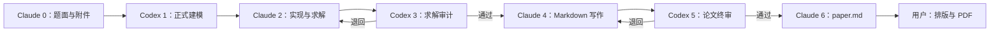
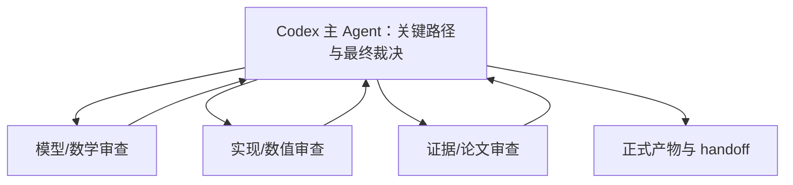

# cumcm-skill


[](./LICENSE)

**给 CUMCM（全国大学生数学建模竞赛）用的 AI 接力工作流。** 让 Claude Code 和 Codex 两个 AI 客户端轮流干活：一个负责建模推理和审计，一个负责写代码、跑结果、写论文，中间靠文件交接，最后产出一份 `paper.md`。

比赛三天，你不用记住谁该干什么。状态文件会告诉你现在该打开哪个客户端。

---

## 它解决什么问题

单个 AI 从头包到尾写建模论文，常见翻车点有四个：

| 常见翻车 | 本 Skill 的应对 |
|---|---|
| 题意口径没固定，复杂算法算得很漂亮但对象、单位或聚合方式错了 | `quality_contract.json` 逐问固定分析单位、指标、约束、不变量、基线、保真度与结论边界 |
| 模型和代码不一致，论文里写的公式和实际跑的不是一回事 | Codex 出正式 `model_spec.md`，Claude 按契约实现，偏离必须写进 `model_deviations.md` |
| 结果跑不出来 / 换台机器复现不了 | `run_manifest.json` 强制登记 `run_id`、`seed`、命令、代码和结果路径 |
| 摘要、正文、图表来自不同轮运行，核心数字互相打架 | `result_registry.json` 作为核心数字唯一索引，登记单位、作用域、来源定位和证据文件 |
| AI 自己夸自己通过，占位符和 `TODO` 直接进终稿 | Stage 2/4/6 有**脚本级预检**，占位符、断图、引用错号、凭据残留直接拦住，不是"AI 说没问题" |
| 换客户端上下文全丢，只能复制聊天记录 | 交接走 `state/workflow.json` + 标准交接单，新会话读文件就能接上 |

一句话：它把"AI 帮你写建模论文"变成**有审计、有验证、可复现**的流程。

---

## 亮点

**1. 双 AI 互审，不是自我评分**
Claude 写实现和论文，Codex 独立审计。审不过就打回重做（Stage 3 退回 2，Stage 5 退回 4）。审计方不改代码，只出结构化修改单，避免"边改边夸"。

**2. 机械化质量门，拦得住幻觉**
`validate_stage.py` 在关键流转点强制运行，不通过就**报错并且不改状态**，绕不过去。它检查的是机器能确定判定的东西：

- 模型规格或质量契约改了但结果没重跑（checksum 不匹配）
- 逐问 id 不一致、质量契约未填，或某问没有 primary 结果指标
- 论文里残留 `TODO` / `FIXME` / 模板占位符
- 插图路径解析不到文件，或引用了已标记作废的图
- 正文引用编号在参考文献里找不到对应条目
- 疑似 API key / token 写进了交付物

**3. 零配置启动**
不问你队伍几个人、成员会什么、截止时间、要不要"冠军模式"。把题面和附件丢进 `input/`，直接开工。

**4. 文献必须真核验**
只有标题和 metadata 的记录不能用来支撑实质结论，`validate_literature.py` 会拒。国内来源优先级（官方文件/国标 → 同行评审期刊 → 学位论文 → 会议报告）写进了规则。

**5. 自带 CUMCM 资料库**
`competitions/cumcm/` 里有 42 条反模式检查、论文骨架、摘要模板、措辞库和真题库，不是通用建模模板。

**6. 不覆盖、不冲突**
共享状态用 `revision` 守卫，同一时刻只有一个 owner 能写。两个客户端同时开着也不会互相踩。

---

## 最终你会拿到什么

```text
paper.md                        # 唯一交付物，完整 Markdown 论文
submission_checklist.md         # 提交前自查清单
support_materials_manifest.md   # 支撑材料清单
code/ results/ figures/         # 可复现的代码、结果、图表
```

**`paper.md` 需要你自己导入 Word/WPS 排版并导出 PDF。** 本 Skill 不做排版，也不会声称字体、页边距、页码已符合当届要求 —— 那部分必须人工核对官方通知。

---

## 开始前需要什么

| 必需 | 说明 |
|---|---|
| Python ≥ 3.10 | 只用标准库跑工作流，不装额外包也能启动 |
| Claude Code | 负责 Stage 0、2、4、6 |
| Codex | 负责 Stage 1、3、5 |

**只有一个客户端怎么办？** 也能跑，但会失去互审价值。你需要在同一客户端里明确切换身份（说"以 codex 身份继续"），审计的独立性会打折。建议两个都装。

建模代码真正要用的科学计算包（numpy、scipy、cvxpy、sklearn 等）按需安装，清单在 `templates/shared/requirements.txt`，不用一次装全。

---

## 安装（三步）

### 1. 克隆到主目录

```bash
git clone https://github.com/GouoZR/cumcm-skill.git ~/.agents/skills/cumcm-skill
```

### 2. 让 Claude Code 指向同一份（关键）

**不要复制两份。** 两份副本会各自漂移，最后你不知道哪份是新的。Windows 用 Junction 做软链接：

```powershell
$source = [IO.Path]::GetFullPath("$HOME\.agents\skills\cumcm-skill")
$target = [IO.Path]::GetFullPath("$HOME\.claude\skills\cumcm-skill")

# 如果 target 已存在，先备份再替换
if (Test-Path $target) {
  $backup = "$target.backup-$(Get-Date -Format yyyyMMdd-HHmmss)"
  if ((git -C $target status --porcelain)) { throw "存在未提交修改，先处理再迁移" }
  Move-Item -LiteralPath $target -Destination $backup
}
New-Item -ItemType Junction -Path $target -Target $source
Get-Item -LiteralPath $target | Select-Object FullName, LinkType, Target
```

macOS / Linux 用符号链接：

```bash
ln -s ~/.agents/skills/cumcm-skill ~/.claude/skills/cumcm-skill
```

### 3. 自检

```bash
python ~/.agents/skills/cumcm-skill/scripts/doctor.py --competition cumcm
```

看到 `Summary: 13 passed, 0 failed` 就装好了。

---

## 小白上手：完整走一遍

### 第 0 步：建项目文件夹

```text
my-cumcm-2026/
└── input/
    ├── problem.pdf     # 题面，PDF 或 Markdown 都行
    └── data/           # 题目给的附件（Excel、CSV 等）
```

只要放这两样。**不需要**提前写队伍信息、选题理由、时间规划。

### 第 1 步：在 Claude Code 里开工

在 `my-cumcm-2026/` 目录打开 Claude Code，然后说：

```text
$cumcm-skill 帮我做这道题，题面和附件在 input/
```

`$cumcm-skill` 是明确调用信号，别省。Claude 会自动初始化工作区、解析题面、清点附件，产出 Stage 0 的分析框架，然后告诉你：**该切到 Codex 了。**

### 第 2 步：切到 Codex

在**同一个项目目录**打开 Codex：

```text
$cumcm-skill 继续
```

Codex 读状态文件，发现自己是 Stage 1 的 owner，开始正式建模：出 `model_spec.md`、`quality_contract.json`、`implementation_contract.md`、文献查询计划。完事后告诉你切回 Claude。

### 第 3 步：来回接力，直到完成

后面就是重复"看它说该谁 → 切过去 → 说继续"：

```text
Claude 0 → Codex 1 → Claude 2 → Codex 3 ─┬─ 不通过 → 回 Claude 2
                                          └─ 通过 → Claude 4 → Codex 5 ─┬─ 不通过 → 回 Claude 4
                                                                         └─ 通过 → Claude 6 → 你排版
```

**不确定现在该谁干？** 任何时候跑这条命令：

```bash
python ~/.agents/skills/cumcm-skill/scripts/workflow.py --workspace . status
```

看 `current_owner` 字段：

- `claude` → 开 Claude Code
- `codex` → 开 Codex
- `user` 且 `status: complete` → 干完了，去检查 `paper.md` 并排版

### 第 4 步：交付

Stage 6 结束后，`paper.md` 就在项目根目录。你要做的：

1. 通读全文，核对公式、数字、引用
2. 导入 Word/WPS，按当届官方要求排版
3. 导出 PDF，对照 `submission_checklist.md` 自查
4. 按官方通知提交

**审计通过 ≠ 论文一定对。** 预检只保证格式、路径、一致性这类机器能判的东西。数学推导是否成立、结果是否合理、创新点是否站得住，最终得你自己看。

---

## 7 个阶段在干什么

| Stage | 谁干 | 干什么 | 产出 |
|---|---|---|---|
| 0 | Claude | 读题、清点附件、搭事实框架 | `artifacts/problem_analysis.md`、`data_inventory.md` |
| 1 | Codex | 查漏、定正式模型、冻结逐问质量契约 | `model_spec.md`、`quality_contract.json`、`implementation_contract.md`、文献计划 |
| 2 | Claude | 处理数据、写代码、求解、验证并登记核心结果 | `code/`、`results/`、`figures/`、`result_registry.json`、`run_manifest.json` |
| 3 | Codex | 审模型—代码—结果是否一致、够不够稳健 | `reviews/solution_audit.md`，可退回 Stage 2 |
| 4 | Claude | 基于已验证产物写论文 | `paper_draft.md`、支撑材料清单 |
| 5 | Codex | 终审逻辑、数学、结果、文献 | `final_review.md`、`final_patch_plan.json`，可退回 Stage 4 |
| 6 | Claude | 应用修改单、装配终稿 | `paper.md`、`submission_checklist.md` |

Stage 0 只建立事实，**不提前冻结模型** —— 避免第一步就把方向锁死。

---

## 常见问题

**Q：一定要两个客户端吗？**
不是硬性要求，但互审是核心价值。只用一个的话，独立审计会退化成自我复查。

**Q：中途关电脑 / 换设备能接着做吗？**
能。所有进度在项目的 `state/` 和产物文件里，不在聊天记录里。换设备把项目文件夹拷过去，说"继续"就行。

**Q：AI 说审计通过，但我觉得模型不对？**
你的判断优先。直接指出问题，让它退回上一阶段重做。工作流本身支持 Stage 3→2、5→4 的回退。

**Q：预检报错了怎么办？**
报错信息里的 `errors` 字段会写明缺什么文件、哪个校验和不匹配。修好再重试。也可以手动跑自查：

```bash
python <skill>/scripts/validate_stage.py --workspace . --stage 2
```

**Q：为什么不直接生成 Word 或 PDF？**
排版细节（字体、页边距、页眉、分页）每届可能变，自动生成容易给你一个"看起来合规"的假象。交付 Markdown，排版留给你对着官方通知做。

**Q：文献检索用不了会卡住吗？**
不会。Sciverse 是可选增强，没配也不阻断建模和写作阶段。

**Q：会不会把我的 API key 写进论文？**
预检专门检查凭据残留。规则上也禁止把 token 写进状态、日志、论文或交接单，MCP 配置只允许在用户全局作用域。

**Q：能保证获奖吗？**
不能。这是协作和质量控制工具，"国奖级"指质量目标，不是奖项承诺。

---

## 进阶：架构与内部机制

<details>
<summary>为什么要做成双 Agent 接力（点开）</summary>

两个客户端不共享聊天上下文，所以不能靠"把上次对话复制过来"。v2 把模型规格、实现契约、结果、审计意见和论文修改单全部落到工作区文件，由状态文件指定唯一负责人。



聊天记录不是接口；`state/workflow.json`、阶段产物和标准交接单才是接口。

</details>

<details>
<summary>Codex 阶段内部专家审查（点开）</summary>

Stage 1、3、5 采用"Codex 主 Agent 裁决 + 动态 SubAgent 独立审查"：



SubAgent 默认只读，不修改 `workflow.json`、共享产物或交接单。主 Agent 独立核验证据，**不按多数票决定通过**；confirmed blocker 或未闭环 high 问题会触发修订。Claude 在 Stage 2、4 也可以按子问题或章节并行，但落盘前必须主 Agent 亲自核验。

角色建议见 `references/runtime/codex_subagents.md` 和 `claude_subagents.md`。

</details>

<details>
<summary>工作区结构（点开）</summary>

```text
project/
├── input/                      # 你放题面和附件
├── state/
│   ├── workflow.json           # 唯一流程状态，schema 4.0
│   ├── capabilities.json       # 可选能力状态，不含密钥
│   ├── artifact_manifest.json  # 产物登记，带 sha256
│   └── handoffs/               # 历史交接单
├── artifacts/
│   ├── quality_contract.json   # 逐问语义、验证义务与结论边界
│   └── run_manifest.json       # 可复现运行清单与契约校验和
├── literature/                 # 查询计划、文献库、claim map
├── code/
├── results/
│   └── result_registry.json    # 核心数字唯一索引
├── figures/
├── reviews/
│   └── subagents/              # 专家报告，不是流程状态
├── paper_workspace/
├── paper_draft.md
└── paper.md
```

`revision` 防止两个客户端覆盖彼此状态；非当前 owner 不得修改共享产物。

</details>

<details>
<summary>质量门具体拦什么（点开）</summary>

Stage 2、4、6 的完成条件由 `scripts/validate_stage.py` 机械判定，`workflow.py` 在 2→3、4→5 的 `handoff` 和 Stage 6 的 `complete` 处强制执行。失败则命令报错且**不修改** `workflow.json`。Stage 3→2、5→4 的退回不跑完成预检。

- **Stage 2**：规格文件缺失；新工作区的 `quality_contract.json` / `result_registry.json` 未填或未登记；逐问 id 不一致；每问缺 primary 指标；`run_manifest.json` 未填；状态、规格或质量契约 checksum 不一致；子问题缺 `command` / `seed` / `code` / `results` / `figures`；声明的文件不存在或为空
- **Stage 4**：新工作区的质量契约或结果注册表失效；草稿或分节缺失；残留 `TODO` / `FIXME` / `TBD` / 占位符；图片路径解析不到；有标题但正文空；引用编号在参考文献无对应条目；命中凭据模式；引用了 `needs_revision` 或 `stale` 的图
- **Stage 6**：新工作区的结果注册表失效；`paper.md` 缺失或为空；`final_patch_plan.json` 不是 `verdict=passed, target_stage=6`；仍有 `pending` 条目；`blocker` / `high` 被写成 `accepted`；`accepted` 没写 `resolution_note`；`paper.md` 未以 `status=final` 登记

预检**不覆盖**数学正确性、结果合理性和创新性 —— 它只确认契约已填写、id/checksum/路径一致、核心结果可定位；不变量是否真的成立、基线是否合理、结论是否越界仍由 Codex Stage 3/5 审查。通用分题型审计清单见 `references/audit/competition_quality_gates.md`，协议明细见 `references/handoff_protocol.md`。

</details>

<details>
<summary>文献与生图能力（点开）</summary>

**文献**：Sciverse 是首选但非硬依赖。Codex 提查询计划和待支撑 claim，任一配置了 Sciverse 的宿主执行检索，结果写入 `literature/library.json` 和 `claim_map.json`。Claude 只引用已核验记录，Codex 检查 claim—证据对应关系。metadata-only 记录不能证明实质结论。国内来源优先级：官方文件/国标 → 同行评审期刊 → 学位论文 → 会议或研究报告 → 国外高质量论文。详见 `references/sciverse_guide.md`。

**生图**：PackyAPI 概念图默认关闭，只有你明确要求才启用。表达优先级：

```text
Python 数据图 > Mermaid/SVG 技术图 > AI 概念图
```

AI 图不得承载唯一的算法说明、关键数字、参数或公式。服务不可用时不阻断工作流。

所有 MCP 必须配置在用户全局作用域，禁止项目级 `.mcp.json`。API token 不进入聊天、仓库、状态、日志、论文或交接单。

</details>

---

## 脚本速查

| 脚本 | 用途 |
|---|---|
| `scripts/init_workspace.py` | 初始化工作区，不覆盖已有状态 |
| `scripts/workflow.py` | owner/revision 守卫，`status` / `start` / `handoff` / `complete` |
| `scripts/validate_stage.py` | Stage 2/4/6 程序化预检 |
| `scripts/validate_handoff.py` | 校验交接单，拒绝未填写的模板 |
| `scripts/validate_literature.py` | 校验文献元数据和 claim 证据链 |
| `scripts/assemble_paper.py` | 装配 `paper.md`，不生成 PDF |
| `scripts/doctor.py` | 环境与包结构自检 |
| `scripts/generate_concept_image.py` | 可选 PackyAPI 概念图 |

旧版评分、差分修改和 AI 使用台账脚本保留用于兼容旧项目。完整参数见 `scripts/README.md`。

---

## 开发者：验证

```bash
python -m compileall -q scripts templates/shared/code_starter
python -m unittest discover -s tests -p 'test_*.py' -v
python scripts/doctor.py --competition cumcm
git diff --check
```

---

## 致谢与边界

本项目基于 [mathmodel-skill](https://github.com/handsomeZR-netizen/mathmodel-skill) v6.1.0 演进而来，感谢原作者徐子锐（handsomeZR-netizen）的流程设计与资料组织。v1 的 10 阶段资料保留用于旧项目兼容；v2 新项目使用 7 阶段流程。

本 Skill 是协作和质量控制工具，**不保证奖项**。竞赛规则会变化，正式提交前必须核验当届官方通知。`paper.md` 中的公式、代码结果、事实、引用和 AI 使用披露均需参赛团队最终复核。
